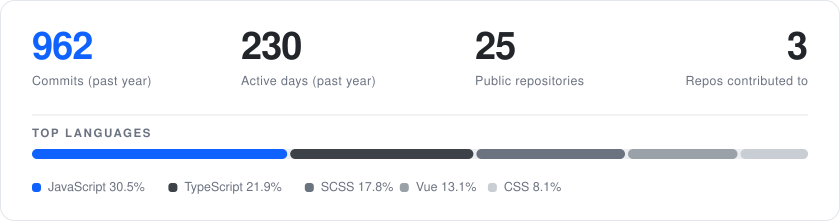

<picture>
  <source media="(prefers-color-scheme: dark)" srcset="assets/brand/banner-dark.svg">
  
</picture>

Front-end by trade: TypeScript, Vue and React, component libraries and build tooling.
Working toward full stack — Python on PostgreSQL, containerised with Docker, and LLM agent
workflows built with LangGraph.

[LinkedIn](https://www.linkedin.com/in/hsin-ju-hsieh) · [Email](mailto:jackjohnton789@gmail.com) · [LeetCode](https://leetcode.com/u/jackjohnton789/)

---

## Tech

<table>
  <tr><td><b>Core</b></td><td>TypeScript · JavaScript · Vue 3 · React · Sass · Tailwind CSS · Vite</td></tr>
  <tr><td><b>Working knowledge</b></td><td>Nuxt · Node.js · Redux Toolkit / Redux-Saga · Pinia · Storybook · Webpack · MUI · ESLint / Prettier</td></tr>
  <tr><td><b>Familiar</b></td><td>Express · MongoDB · Bootstrap · Shell</td></tr>
  <tr><td><b>Learning</b></td><td>Python · PostgreSQL · Docker · LangGraph · LLM agents</td></tr>
</table>

## GitHub

<picture>
  <source media="(prefers-color-scheme: dark)" srcset="assets/stats-dark.svg">
  
</picture>

Rendered from the GitHub API by a workflow in this repo, so it never depends on a third-party service staying up.
